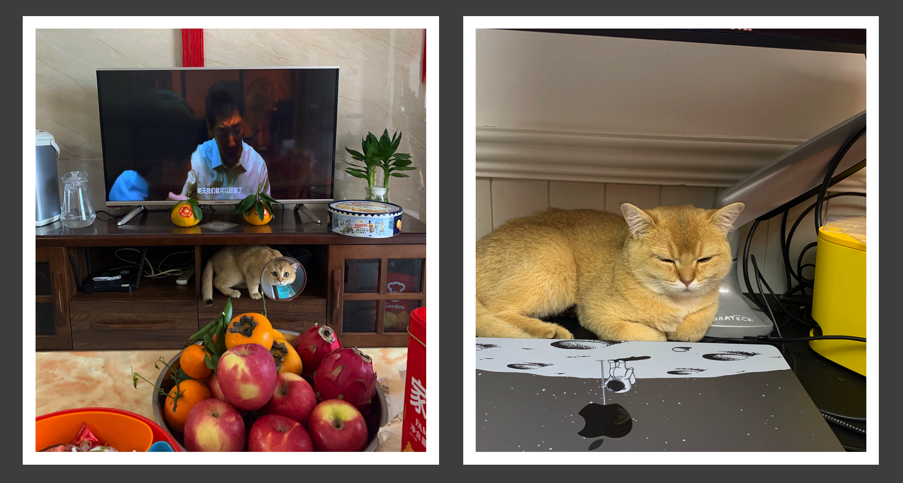

Hey, I'm Cooper, a slashie with a knack for both biosciences and computing. I've worked as a bioinformatics engineer at a startup, handling website construction and maintenance as well as the development of bio-software. I am working hard to become an independent developer that satisfies my own standards.

Besides that, I'm an experienced cat owner, tending to two American Shorthair girl—one golden shaded and one silver shaded munchkin. My goal is to adopt another golden shaded boy and a pair of Corgis.

I love wandering around and soaking up sights; my current stomping grounds are in Guangzhou. I dream of being a digital nomad, not confined to any specific spot.

