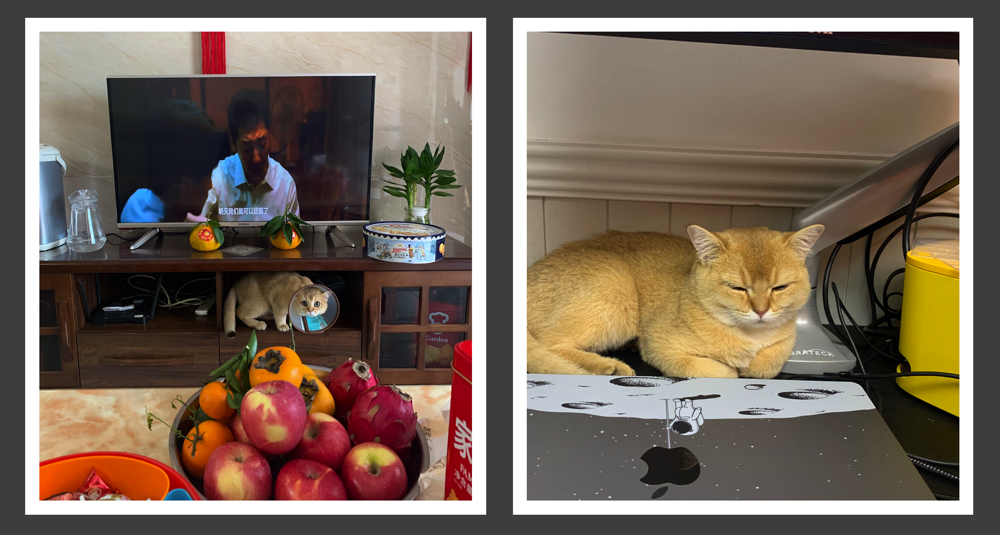
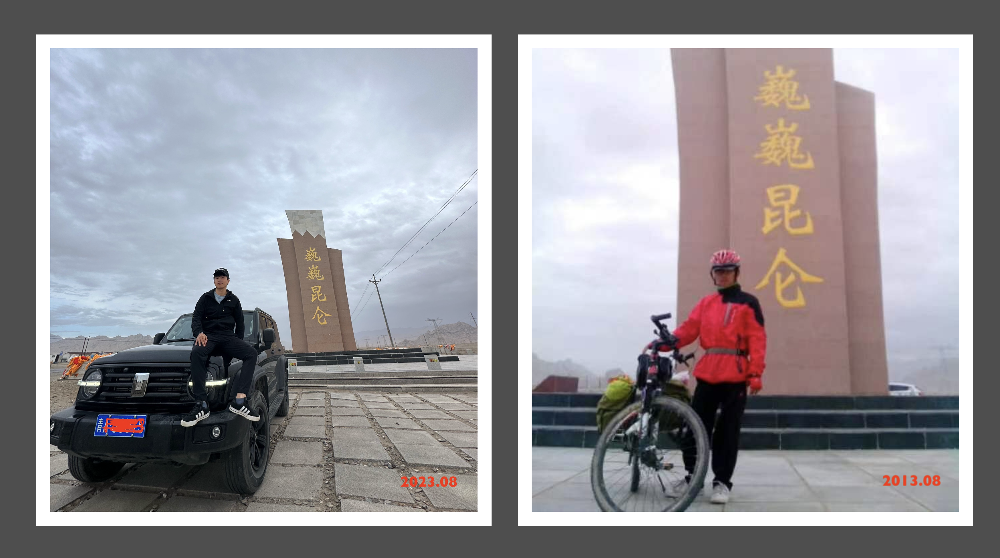

Hey，我是Cooper，一个略懂生物科学与计算机的斜杠青年。我曾在一家初创公司担任生物信息工程师，负责网站搭建维护与生物软件的开发工作。目前，我正在努力成为一个让自己满意的独立开发者。

另外，我是一名经验丰富的铲屎官，家里养了两只美短妹妹，一只金渐层和一只矮脚的银渐层。我的目标是再养一只金渐层弟弟和一对柯基。

我喜欢到处走走停停看看，希望有生之年可以游遍祖国大好河山，除了山东。如果要选一个地方养老，我可能会选择成都或者广东。目前的物理活动范围主要在广州，理想是当个数字游~~民~~侠，不用拘泥于一亩三分地。

我希望在这里记录自己的学习成长过程，可能谈技术，也可能~~夹带个人观点~~ （🦐🖊️🖊️）。

